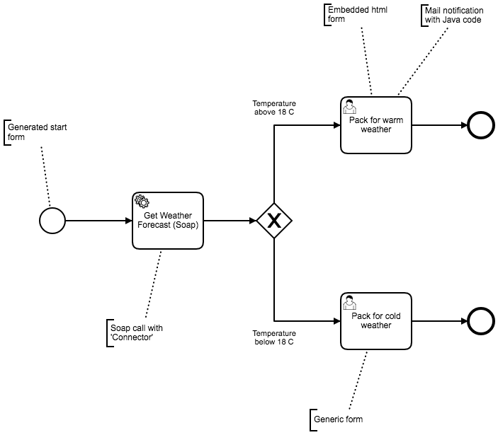

= Kcell demo process application
:author: Tair Sabirgaliev
:email: <tair.sabirgaliev@gmail.com>

This demo showcases the Kcell proof of concept application

== Features implemented

The following features are implemented:

* Basic process implementation
** Exclusive gateway with runtime decision
** Service task to call a remote SOAP service
* Task assignment to individuals or groups
* Tasklist UI
* Task forms
** Generated forms based on BPMN metadata extension
** Embedded html forms
** Generic forms built at runtime
* Process runtime info
* Task comments
* Mail notification on task assignment

Here is the BPMN diagram of the demo process:

== How to get started

You need Docker stack of tools (`docker` + `docker-compose`) and Maven 3.3.9 and a decent Internet connection (Maven will download half of internet, the other half is downloaded by docker).

First, build demo process application:
----
$ cd kcell-demo-process-app
$ mvn package
$ cd ..
----

Initialize database container:
----
$ docker-compose up db
----

Start all the containers:
----
$ docker-compose up
----
Now you can navigate to http://localhost:8080/camunda. Also, the Postgresql database is exposed at `localhost:5432`

Stop the containers started in background:
----
$ docker-compose stop
----

Stop and clean all the container state (including db):
----
$ docker-compose down
----

== Where to go next?
* http://camunda.org
* https://hub.docker.com/r/camunda/camunda-bpm-platform
* http://bpmn.io
